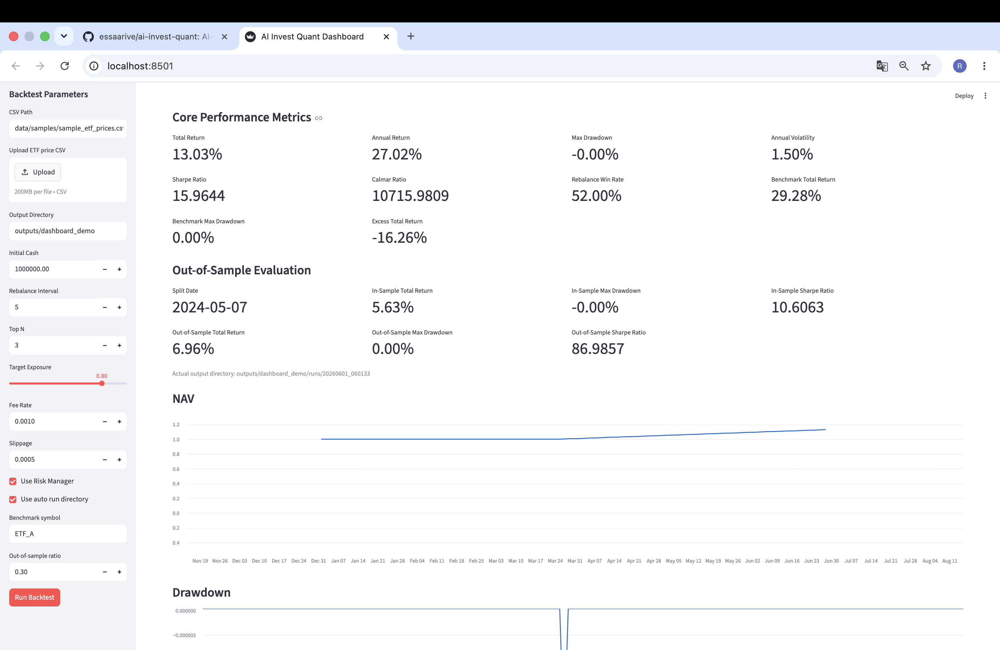
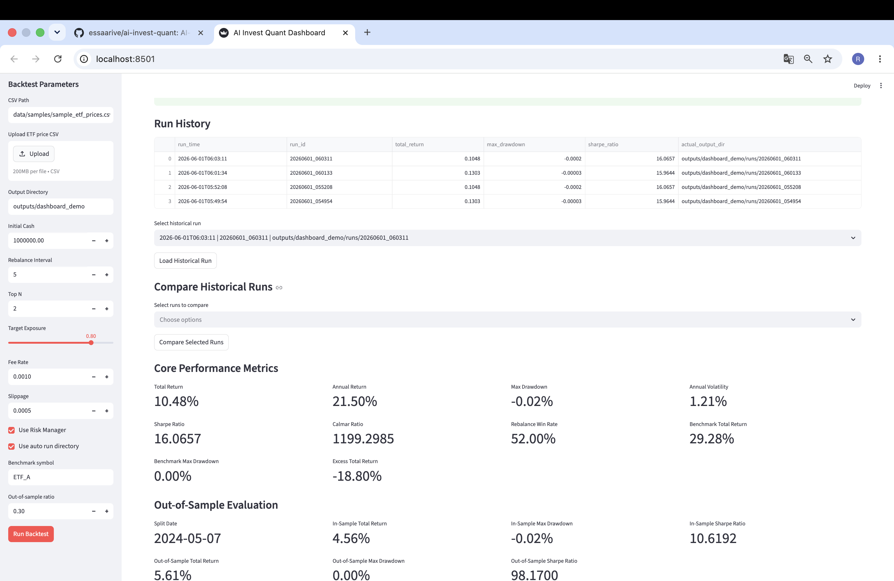
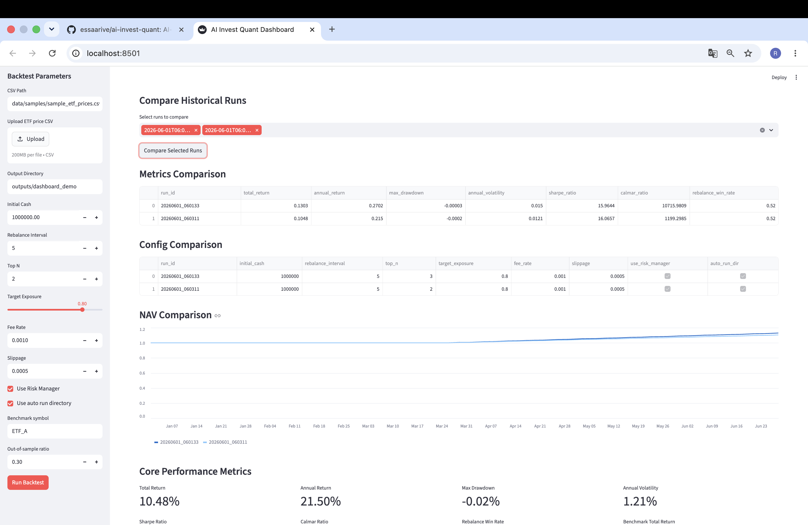

# AI Invest Quant

[](https://github.com/essaarive/ai-invest-quant/actions/workflows/ci.yml)


AI-assisted ETF rotation research MVP with backtesting, risk controls, benchmark comparison, out-of-sample evaluation, experiment tracking, and Streamlit dashboard.

Current version: V0.3.1 Research Workbench.

Current local test status: 250 passed.

## What This Project Does

- Load local ETF OHLCV CSV data
- Generate ETF rotation signals
- Use a lightweight Strategy interface for future strategy extensions
- Run historical backtests
- Apply risk controls
- Compare strategy performance against a benchmark ETF
- Evaluate in-sample vs out-of-sample performance
- Track experiments with `metadata.json` and `runs/index.csv`
- Run lightweight parameter sensitivity analysis
- Run lightweight walk-forward testing with rolling train/test windows
- Explore results in a local Streamlit Dashboard

## Dashboard Preview

Dashboard overview:



Run history:



Historical run comparison:



## Project Docs

- [Project Status](docs/PROJECT_STATUS.md)
- [Architecture](docs/ARCHITECTURE.md)
- [Roadmap](docs/ROADMAP.md)
- [Demo Guide](docs/DEMO_GUIDE.md)
- [Data Guide](docs/DATA_GUIDE.md)

## Quick Start

Install development dependencies and run the built-in ETF rotation demo:

```bash
pip install -e ".[dev]"
ai-invest-quant run-demo
```

Open the local Dashboard:

```bash
streamlit run dashboard/app.py
```

By default, demo outputs are written to `outputs/demo/`.

## Typical Workflow

1. Prepare ETF CSV data with `date,symbol,open,high,low,close,volume,amount`
2. Run a backtest from the CLI or Dashboard
3. Review the Markdown report and Dashboard charts
4. Compare strategy performance with a benchmark ETF
5. Check out-of-sample performance
6. Compare historical runs from `runs/index.csv`

## Key Features

| Area | Capability |
| --- | --- |
| Data | Local CSV loading, ETF CSV data adapter, validation, cleaning, sorting, and deduplication |
| Indicators | MA20 / MA60 / MA120, daily return, 20-trading-day return |
| Strategy | Strategy interface plus ETF Rotation Strategy target-weight signals |
| Backtest | Next-open execution, fees, slippage, trades, positions, NAV |
| Risk | Position cap, exposure cap, defensive mode based on drawdown |
| Performance | Total return, drawdown, volatility, Sharpe, Calmar, turnover, win rate |
| Benchmark | Strategy vs Benchmark comparison using a selected ETF symbol |
| OOS | Out-of-Sample Evaluation by splitting the latest date range |
| Experiments | JSON config, `metadata.json`, `auto_run_dir`, `runs/index.csv` |
| Parameter Sensitivity Analysis | Batch run ETF rotation parameter combinations and save `sensitivity_summary.csv` |
| Walk-forward Testing | Rolling train/test windows with each test window saved as a separate backtest |
| Dashboard | English / 中文 labels, CSV upload, output downloads, run history, historical run comparison |

The Strategy interface is available for future strategy extensions. The current implemented
strategy is `ETF Rotation Strategy`, and the existing pipeline still uses the same ETF rotation
logic and function-compatible API.

## What Is Not Supported

- No live trading
- No broker connection
- No automatic order placement
- No real-time data feed
- No Crypto trading
- No user accounts or cloud deployment
- No investment advice

## CSV Data Format

Input CSV files must contain:

```text
date,symbol,open,high,low,close,volume,amount
```

Example:

```csv
date,symbol,open,high,low,close,volume,amount
2024-01-01,ETF_A,79.7502,80.3095,79.2717,79.9100,100000,7991000.0000
2024-01-01,ETF_B,82.3153,82.8104,81.8214,82.4100,105000,8653050.0000
```

Rules:

- `date` must be parseable by pandas.
- `symbol` cannot be empty.
- `open`, `high`, `low`, and `close` must be numeric and greater than 0.
- `volume` and `amount` must be numeric and greater than or equal to 0.
- `high` must be greater than or equal to `open`, `close`, and `low`.
- `low` must be less than or equal to `open`, `close`, and `high`.

The data adapter can standardize common Chinese and English ETF CSV exports into this format.
See [Data Guide](docs/DATA_GUIDE.md) for examples.

## Install

Development install:

```bash
pip install -e ".[dev]"
```

Legacy dependency-only install:

```bash
pip install -r requirements.txt
```

## Run Tests

```bash
PYTHONPATH=src python3 -m pytest
```

## Development Checks

Install development dependencies:

```bash
pip install -e ".[dev]"
```

Run tests:

```bash
python3 -m pytest
```

Run Ruff lint checks:

```bash
ruff check .
```

Run Ruff formatting:

```bash
ruff format .
```

`pytest` verifies functional correctness. Ruff is used for code quality checks and formatting.

CI runs on GitHub Actions for pushes and pull requests:

- `ruff check .`
- `python -m pytest`

## Run Demo Pipeline

Use the bundled sample data:

```bash
ai-invest-quant run-demo
```

This uses:

```text
data/samples/sample_etf_prices.csv
```

and writes to:

```text
outputs/demo/
```

The script accepts a custom output directory:

```bash
PYTHONPATH=src python3 scripts/run_demo.py --output-dir /tmp/ai_invest_quant_demo
```

## CLI Usage

View help:

```bash
ai-invest-quant --help
```

Legacy module form:

```bash
PYTHONPATH=src python3 -m ai_invest_quant.cli --help
```

Run the default demo:

```bash
ai-invest-quant run-demo
```

Legacy module form:

```bash
PYTHONPATH=src python3 -m ai_invest_quant.cli run-demo
```

Run with explicit parameters:

```bash
ai-invest-quant run-demo \
  --csv-path data/samples/sample_etf_prices.csv \
  --output-dir outputs/demo \
  --initial-cash 1000000 \
  --rebalance-interval 5 \
  --top-n 3 \
  --target-exposure 0.8 \
  --fee-rate 0.001 \
  --slippage 0.0005 \
  --benchmark-symbol ETF_A \
  --out-of-sample-ratio 0.3 \
  --no-risk-manager
```

Run from a local experiment config:

```bash
ai-invest-quant run-demo --config configs/demo_config.json
```

Override config values from the CLI:

```bash
ai-invest-quant run-demo \
  --config configs/demo_config.json \
  --top-n 2 \
  --output-dir outputs/config_test
```

Automatic timestamped experiment directory:

```bash
ai-invest-quant run-demo --output-dir outputs --auto-run-dir
```

Benchmark comparison:

```bash
ai-invest-quant run-demo --benchmark-symbol ETF_A
```

`benchmark_symbol` is used only as a local historical backtest comparison baseline. It does not represent future returns and does not create live orders.

Out-of-Sample Evaluation:

```bash
ai-invest-quant run-demo --out-of-sample-ratio 0.3
```

`out_of_sample_ratio` uses the last 30% of trading dates as the out-of-sample period. It does not change strategy signals, execution, or risk logic; it only evaluates the completed NAV results. Out-of-sample performance does not guarantee future returns.

Parameter Sensitivity:

From the CLI:

```bash
ai-invest-quant run-sensitivity \
  --top-n-values 1,2,3 \
  --target-exposure-values 0.5,0.8 \
  --rebalance-interval-values 5,10 \
  --benchmark-symbol ETF_A
```

The Dashboard can batch run multiple `top_n`, `target_exposure`, and `rebalance_interval`
combinations. Each combination is saved as a separate timestamped experiment, and the aggregate
results are written to `sensitivity_summary.csv`.

This is for research stability checks only. It does not recommend investment parameters.

Walk-forward Testing:

From the CLI:

```bash
ai-invest-quant run-walk-forward \
  --train-window-days 120 \
  --test-window-days 60 \
  --step-days 60 \
  --benchmark-symbol ETF_A
```

The Dashboard can run rolling train/test windows. Each test window is executed as a separate
historical backtest, and the aggregate results are written to `walk_forward_summary.csv`.

This is for robustness research only and does not provide investment advice.

This creates a directory similar to:

```text
outputs/runs/20260531_031530/
```

Parameter priority is:

```text
CLI arguments > config file > defaults
```

The `ai-invest-quant` CLI only runs local historical backtests. It does not connect to real brokers, does not place orders, and does not provide investment advice.

## Dashboard

Install development dependencies:

```bash
pip install -e ".[dev]"
```

Run the local Streamlit Dashboard:

```bash
streamlit run dashboard/app.py
```

The Dashboard lets you configure the bundled demo backtest, run it locally, and view:

- Core performance metrics
- NAV curve
- Drawdown curve
- Latest positions
- Recent trades
- Recent signals
- Generated Markdown report
- CSV upload for your own ETF price data
- Buttons to download output files
- Local JSON experiment config save/load for reproducible runs
- Optional auto run directory naming to avoid overwriting old outputs
- Run History browsing, single-run loading, and Compare Historical Runs for local historical outputs
- Benchmark symbol input, Strategy vs Benchmark chart, and benchmark output downloads
- Out-of-sample ratio input and Out-of-Sample Evaluation metrics

Dashboard supports English / 中文 labels for easier local research use. 中文模式 now
localizes key metric labels and table column names in the Dashboard display layer. Downloaded
CSV files keep their original English column names for programmatic use.

By default, Dashboard outputs are written to:

```text
outputs/dashboard_demo/
```

The default Dashboard experiment config is:

```text
configs/demo_config.json
```

The config is a local JSON file containing run parameters:

```json
{
  "csv_path": "data/samples/sample_etf_prices.csv",
  "output_dir": "outputs/dashboard_demo",
  "initial_cash": 1000000,
  "rebalance_interval": 5,
  "top_n": 3,
  "target_exposure": 0.8,
  "fee_rate": 0.001,
  "slippage": 0.0005,
  "use_risk_manager": true,
  "auto_run_dir": false,
  "benchmark_symbol": "ETF_A",
  "out_of_sample_ratio": 0.3
}
```

Use `Load Config` in the sidebar to load parameters from a JSON file. Use `Save Config` to save the current Dashboard parameters for later reproduction.

Set `auto_run_dir` to `true` or enable `Use auto run directory` in the sidebar to write outputs under:

```text
<output_dir>/runs/YYYYMMDD_HHMMSS/
```

If a run directory already exists in the same second, a suffix such as `_001` is appended.

When `auto_run_dir` is enabled, the project also maintains a run history index:

```text
<output_dir>/runs/index.csv
```

The Dashboard shows this index in the `Run History` section.

To inspect an older run without rerunning the backtest:

1. Open the Dashboard.
2. Make sure `Output Directory` points to the base directory that contains `runs/index.csv`.
3. Use `Select historical run` in the `Run History` section.
4. Click `Load Historical Run`.

The Dashboard loads the selected run's `nav.csv`, `trades.csv`, `positions.csv`, `signals.csv`, `report.md`, and `metadata.json` from disk. It does not rerun the backtest. If any historical output file is missing, the Dashboard displays a clear missing-file warning and continues showing the files that are available.

To compare multiple historical runs without rerunning backtests:

1. Open the Dashboard.
2. Make sure `Output Directory` points to the base directory that contains `runs/index.csv`.
3. Use `Select runs to compare` in the `Compare Historical Runs` section.
4. Select 2 to 5 historical runs.
5. Click `Compare Selected Runs`.

The comparison shows a metrics table, a config table, and a normalized NAV chart starting each selected run at 1.0. The data is loaded from local `index.csv`, `metadata.json`, and each run's `nav.csv`. Missing `nav.csv` files are reported clearly and do not stop the other selected runs from being displayed.

The Dashboard sidebar also includes `Benchmark symbol`. If set, the run compares strategy NAV against that benchmark ETF using local CSV close prices. After the run, the Dashboard shows benchmark total return, benchmark max drawdown, excess total return, and a `Strategy vs Benchmark` chart. Benchmark output files can be downloaded with the other outputs.

The sidebar also includes `Out-of-sample ratio`. A value such as `0.3` evaluates the last 30% of dates as the out-of-sample period and shows split date, in-sample return/drawdown/Sharpe, and out-of-sample return/drawdown/Sharpe in the `Out-of-Sample Evaluation` section. This is a local historical robustness check only, not an investment recommendation.

The same config can be used by the CLI:

```bash
ai-invest-quant run-demo --config configs/demo_config.json
```

Experiment config files only store local historical backtest parameters. They should not contain broker credentials or secrets. They do not enable real trading, automatic order placement, or financial advice.

You can use the default sample CSV or upload your own ETF CSV from the sidebar. Uploaded CSV files still go through the same local data validation pipeline and must contain:

```text
date,symbol,open,high,low,close,volume,amount
```

After a run completes, the Dashboard provides download output files buttons for:

- `nav.csv`
- `trades.csv`
- `positions.csv`
- `signals.csv`
- `report.md`
- `metadata.json`
- `benchmark_nav.csv`
- `strategy_vs_benchmark.csv`

The Dashboard only displays local historical backtest results. It does not connect to real brokers, does not download external data, does not place orders, and does not provide investment advice.

The lower-level Python pipeline can also be called directly:

```bash
PYTHONPATH=src python3 -c "from ai_invest_quant.pipeline.run_etf_rotation_demo import run_etf_rotation_demo; run_etf_rotation_demo('path/to/prices.csv')"
```

You can also choose an output directory:

```bash
PYTHONPATH=src python3 -c "from ai_invest_quant.pipeline.run_etf_rotation_demo import run_etf_rotation_demo; run_etf_rotation_demo('path/to/prices.csv', output_dir='outputs/demo')"
```

## Output Files

The demo pipeline writes:

- `nav.csv`: daily cash, positions value, equity, NAV, risk mode, and drawdown
- `trades.csv`: executed trades
- `positions.csv`: daily position snapshots
- `signals.csv`: ETF rotation target-weight signals
- `report.md`: Markdown backtest report
- `metadata.json`: run time, project version, experiment config snapshot, performance summary, and output file paths
- `benchmark_nav.csv`: normalized benchmark NAV for the selected `benchmark_symbol`
- `strategy_vs_benchmark.csv`: strategy NAV and benchmark NAV aligned by date

`metadata.json` is only for local historical backtest tracking. It does not contain broker keys, does not connect to real trading systems, and does not enable automatic order placement.

Regular output:

```bash
ai-invest-quant run-demo --output-dir outputs/demo
```

Timestamped experiment output:

```bash
ai-invest-quant run-demo --output-dir outputs --auto-run-dir
```

This creates:

```text
outputs/runs/
├── index.csv
└── YYYYMMDD_HHMMSS/
    ├── nav.csv
    ├── trades.csv
    ├── positions.csv
    ├── signals.csv
    ├── report.md
    └── metadata.json
```

`index.csv` records each experiment run, including:

- `run_time`
- `run_id`
- `actual_output_dir`
- `total_return`
- `max_drawdown`
- `sharpe_ratio`
- `metadata_path`
- `report_path`

`auto_run_dir` is only for local historical backtest archiving. It does not connect to real brokers, does not place orders, and does not provide investment advice.

## Risk Disclaimer

This project is for historical research and backtesting only. It does not provide financial advice, does not guarantee future results, does not connect to real brokers, and does not place real orders.
